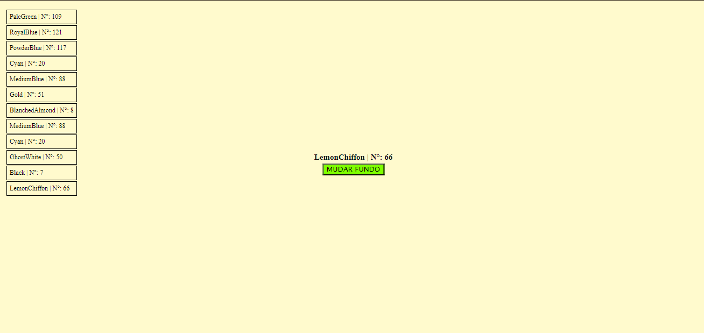
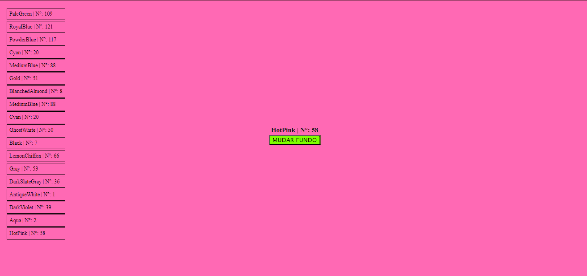

# RandomBackGroundColor
Este projeto contém um botão centralizado que quando clicado muda o background , indica o nome da cor escolhida randomicamente 
e adiciona o nome da cor juntamente com o sua numeração numa espécie de "histórico" de cores na parte esquerda da página.
Este histórico mostra as últimas 20 cores geradas.

